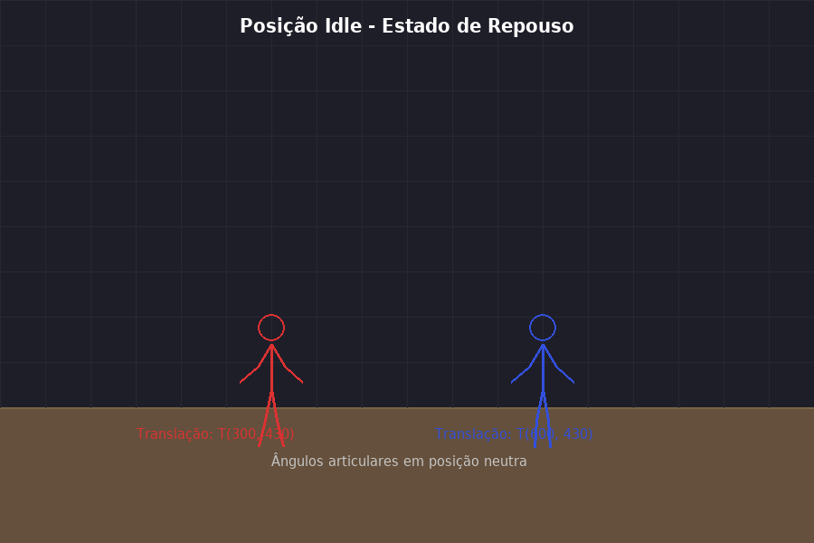
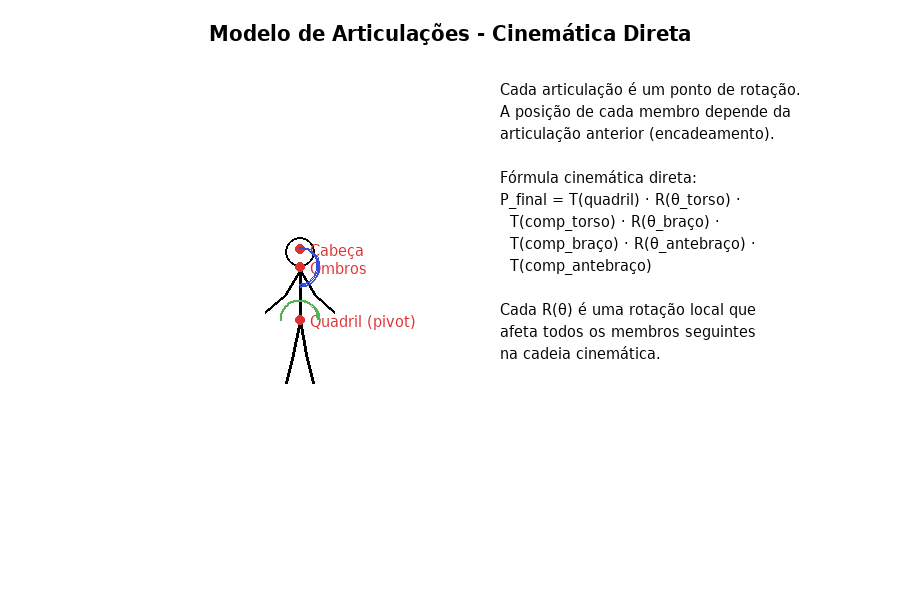
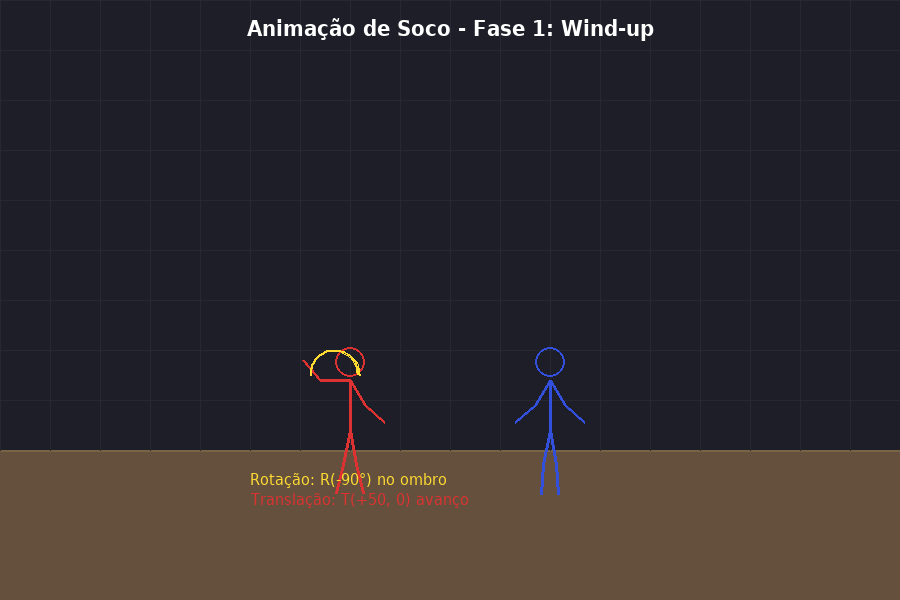
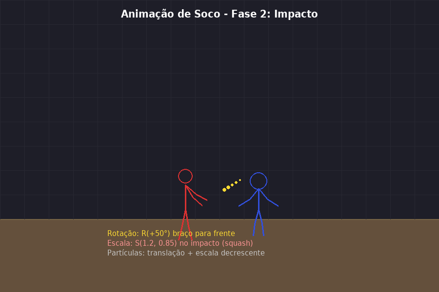
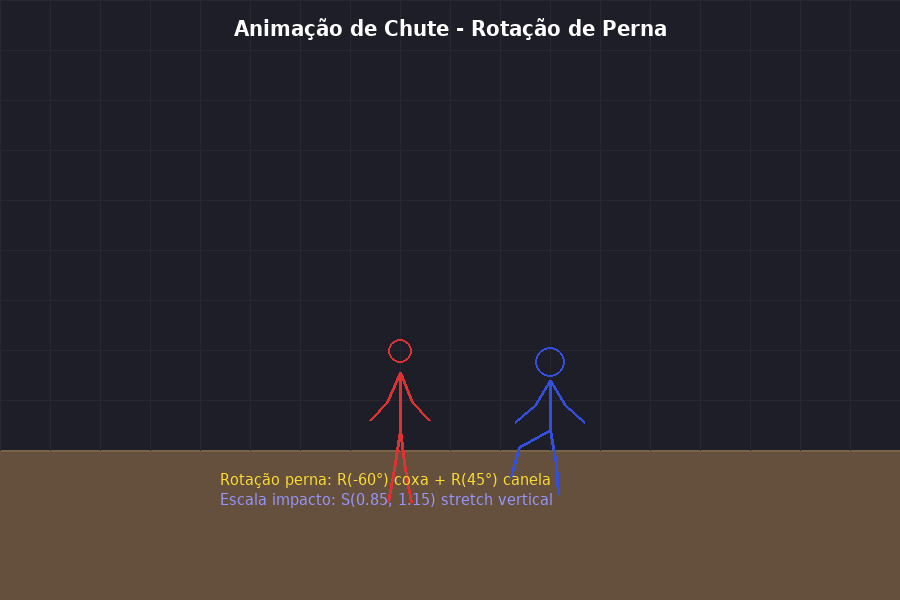
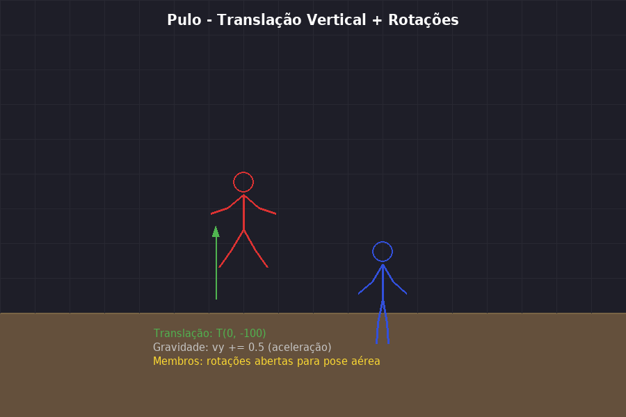
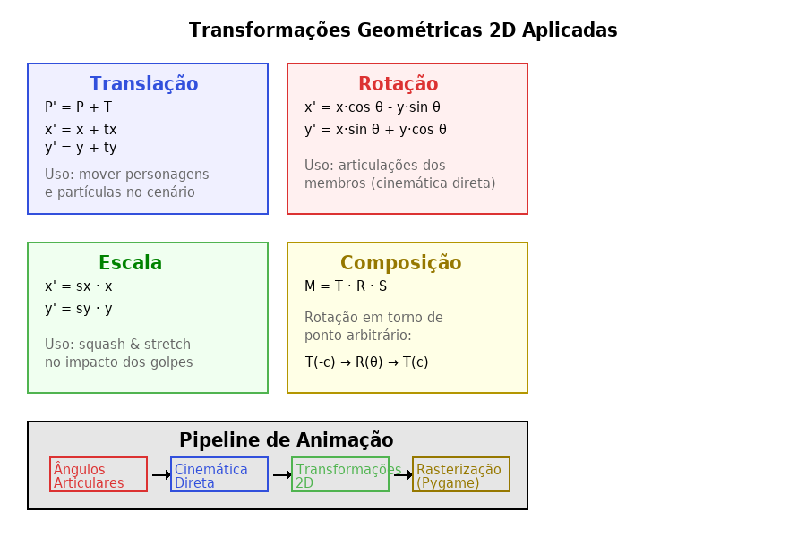

# Estudo de Caso – Computação Gráfica 2D: Animação Estilo Stick Fight

**Aplicação de Transformações Geométricas na Criação de Animações 2D**

| | |
|---|---|
| **Disciplina** | Computação Gráfica e Processamento de Imagens |
| **Curso** | Engenharia de Computação |
| **Aluno** | Jorge Luis de Oliveira Ferrari |
| **RE** | 1170103026 |
| **Data** | Março de 2026 |

---

## Sumário

1. [Introdução](#1-introdução)
2. [Fundamentação Teórica](#2-fundamentação-teórica)
   - 2.1 [Sistema de Coordenadas 2D](#21-sistema-de-coordenadas-2d)
   - 2.2 [Transformações Geométricas 2D](#22-transformações-geométricas-2d)
   - 2.3 [Coordenadas Homogêneas](#23-coordenadas-homogêneas)
   - 2.4 [Composição de Transformações](#24-composição-de-transformações)
3. [Descrição do Projeto: Animação Stick Fight](#3-descrição-do-projeto-animação-stick-fight)
   - 3.1 [Concepção e Planejamento](#31-concepção-e-planejamento)
   - 3.2 [Modelo de Articulações (Stick Figure)](#32-modelo-de-articulações-stick-figure)
   - 3.3 [Cinemática Direta](#33-cinemática-direta)
4. [Implementação das Animações](#4-implementação-das-animações)
   - 4.1 [Animação de Repouso (Idle)](#41-animação-de-repouso-idle)
   - 4.2 [Animação de Soco](#42-animação-de-soco)
   - 4.3 [Animação de Chute](#43-animação-de-chute)
   - 4.4 [Animação de Pulo](#44-animação-de-pulo)
   - 4.5 [Efeitos de Impacto (Squash & Stretch)](#45-efeitos-de-impacto-squash--stretch)
5. [Código-Fonte Funcional (Python/Pygame)](#5-código-fonte-funcional-pythonpygame)
6. [Resultados e Discussão](#6-resultados-e-discussão)
7. [Conclusão](#7-conclusão)
8. [Referências](#referências)

---

## 1. Introdução

A computação gráfica é uma área fundamental da ciência da computação dedicada à geração, manipulação e visualização de conteúdo visual por meio de algoritmos computacionais. Na vertente bidimensional (2D), esta disciplina trabalha com a representação de objetos geométricos em um plano cartesiano e aplica transformações matemáticas para criar efeitos visuais, animações e interfaces gráficas.

Este estudo de caso apresenta o desenvolvimento de uma animação 2D no estilo "Stick Fight" (luta de bonecos de palito), inspirada em jogos e animações que utilizam figuras articuladas simples para representar personagens em combate. O projeto serve como aplicação prática dos princípios da computação gráfica 2D, demonstrando como transformações geométricas fundamentais – translação, rotação e escala – são combinadas para criar movimentos fluidos e expressivos.

O objetivo é detalhar cada etapa do processo criativo e técnico, desde a concepção das formas geométricas até a implementação de um código funcional em Python utilizando a biblioteca Pygame, proporcionando uma visão abrangente de como a teoria matemática se traduz em animação prática.

---

## 2. Fundamentação Teórica

### 2.1 Sistema de Coordenadas 2D

Todo sistema de computação gráfica 2D opera sobre um sistema de coordenadas cartesiano, onde cada ponto é representado por um par ordenado (x, y). Na convenção utilizada por bibliotecas gráficas como Pygame, o eixo X cresce para a direita e o eixo Y cresce para baixo (invertido em relação ao sistema matemático convencional), com a origem (0, 0) localizada no canto superior esquerdo da tela (FRIGERI, 2018).

Na nossa animação, a tela tem dimensões de 900 × 600 pixels. Cada personagem (stick figure) é posicionado neste espaço por meio de um ponto de referência chamado "quadril", que serve como âncora para todas as demais articulações. O chão é definido na coordenada y = 450, criando uma área de 150 pixels para a interface de informações.

### 2.2 Transformações Geométricas 2D

As transformações geométricas são operações matemáticas que modificam a posição, orientação ou tamanho de objetos no plano. Segundo Brookshear (2013), estas transformações são a base de toda animação computacional e podem ser expressas como multiplicação de matrizes, o que permite sua composição eficiente.

#### 2.2.1 Translação

A translação move um objeto de uma posição para outra sem alterar sua forma ou orientação. É definida por um vetor de deslocamento (tx, ty). Para um ponto P(x, y), a translação produz o ponto P'(x', y') conforme a seguinte fórmula (SAÚDE, 2019):

$$
x' = x + t_x \qquad y' = y + t_y
$$

Na animação Stick Fight, a translação é utilizada para: movimentar os personagens pelo cenário (avanço, recuo); simular a gravidade durante pulos (translação vertical com aceleração); e mover partículas de efeito visual após impactos.

#### 2.2.2 Rotação

A rotação gira um objeto em torno de um ponto (centro de rotação) por um ângulo θ (theta). A rotação em torno da origem é dada pelas equações (FRIGERI, 2018):

$$
x' = x \cdot \cos(\theta) - y \cdot \sin(\theta)
$$
$$
y' = x \cdot \sin(\theta) + y \cdot \cos(\theta)
$$

Em forma matricial, temos a **matriz de rotação R(θ)**:

$$
R(\theta) = \begin{bmatrix} \cos\theta & -\sin\theta & 0 \\ \sin\theta & \cos\theta & 0 \\ 0 & 0 & 1 \end{bmatrix}
$$

*Tabela 1: Matriz de rotação R(θ) em coordenadas homogêneas.*

A rotação é a transformação mais utilizada na animação Stick Fight, pois cada articulação (ombro, cotovelo, quadril, joelho) funciona como um ponto de rotação independente. Para rotacionar em torno de um ponto arbitrário C(cx, cy), é necessário compor três transformações: primeiro translada-se o ponto para a origem, aplica-se a rotação, e então translada-se de volta.

#### 2.2.3 Escala

A transformação de escala altera o tamanho de um objeto, podendo ser uniforme (mesmo fator em ambos os eixos) ou não uniforme (fatores diferentes). É definida pelos fatores sx e sy (BROOKSHEAR, 2013):

$$
x' = s_x \cdot x \qquad y' = s_y \cdot y
$$

Na animação, a escala não uniforme é usada para o efeito de "squash and stretch", um dos 12 princípios clássicos da animação definidos por Disney. Quando um personagem recebe um golpe, aplicamos uma escala tipo S(1.2, 0.85) para simular o achatamento horizontal (squash) no momento do impacto, seguido de um retorno suave ao tamanho normal.

### 2.3 Coordenadas Homogêneas

Para unificar todas as transformações em uma única representação matricial, utilizamos coordenadas homogêneas. Um ponto 2D (x, y) é representado como (x, y, 1), permitindo que translação, rotação e escala sejam todas expressas como multiplicação de matrizes 3×3 (SAÚDE, 2019). Isso possibilita a composição eficiente de múltiplas transformações em uma única matriz resultante.

### 2.4 Composição de Transformações

A composição de transformações consiste em aplicar várias transformações em sequência. Matematicamente, isso equivale a multiplicar as matrizes de transformação na ordem inversa de aplicação. Por exemplo, para rotacionar um objeto em torno de um ponto arbitrário C, a matriz composta é (FRIGERI, 2018):

$$
M = T(C) \cdot R(\theta) \cdot T(-C)
$$

Onde T(C) translada o centro de rotação para a origem, R(θ) aplica a rotação, e T(−C) retorna o objeto à posição original. Esta composição é fundamental na animação Stick Fight, onde cada articulação rotaciona em torno de seu ponto de conexão.

---

## 3. Descrição do Projeto: Animação Stick Fight

### 3.1 Concepção e Planejamento

O projeto consiste em criar uma animação de luta entre dois personagens representados como figuras de palito (stick figures), inspirado no estilo de animações e jogos como "Stick Fight: The Game". A animação apresenta uma coreografia automatizada onde os dois lutadores executam uma sequência de movimentos de combate.

> **Elementos do projeto:**
> - Dois personagens articulados (Lutador 1: vermelho, Lutador 2: azul)
> - Cenário com chão e grade de referência
> - Animações: repouso (idle), soco, chute, pulo
> - Efeitos visuais: partículas de impacto, squash & stretch
> - Interface: barras de vida, informações de posição em tempo real

As formas geométricas utilizadas são fundamentalmente primitivas: segmentos de reta (para membros e torso), círculos (para cabeça e partículas) e retângulos (para chão, barras de vida e elementos de interface). Todas estas primitivas são manipuladas exclusivamente por meio de transformações geométricas 2D.


*Figura 1: Posição de repouso (idle) dos dois lutadores no cenário.*

### 3.2 Modelo de Articulações (Stick Figure)

Cada stick figure é modelado como uma estrutura hierárquica de articulações conectadas por segmentos rígidos. O modelo segue uma topologia em árvore com raiz no quadril:

| Articulação | Conecta | Comprimento (px) | Graus de Liberdade |
|-------------|---------|:-----------------:|-------------------|
| Quadril (raiz) | Posição base | – | Translação (x, y) |
| Torso | Quadril → Ombros | 50 | Rotação (θ) |
| Braço superior | Ombro → Cotovelo | 30 | Rotação (θ) |
| Antebraço | Cotovelo → Mão | 25 | Rotação (θ) |
| Coxa | Quadril → Joelho | 35 | Rotação (θ) |
| Canela | Joelho → Pé | 30 | Rotação (θ) |
| Cabeça | Ombros → Centro | r = 15 | Herdado do torso |

*Tabela 2: Estrutura hierárquica das articulações do stick figure.*


*Figura 2: Modelo de articulações com cinemática direta.*

### 3.3 Cinemática Direta

A cinemática direta é a técnica utilizada para calcular a posição de cada articulação a partir dos ângulos das juntas, percorrendo a hierarquia da raiz (quadril) até as extremidades (mãos e pés). Para cada membro, a posição final é calculada como:

$$
P_{extremidade} = T(P_{pai}) \cdot R(\theta_{local}) \cdot \begin{bmatrix} 0 \\ comprimento \end{bmatrix}
$$

Onde P_pai é a posição da articulação pai, θ_local é o ângulo da junta atual, e comprimento é o tamanho do segmento. Na implementação, isso se traduz na função `calcular_ponto_final(início, comprimento, ângulo)`, que utiliza seno e cosseno para determinar as coordenadas do ponto final do segmento:

$$
f_x = início_x + comprimento \cdot \sin(ângulo)
$$
$$
f_y = início_y + comprimento \cdot \cos(ângulo)
$$

O encadeamento das transformações permite que a rotação de uma articulação pai afete automaticamente todas as articulações filhas, criando movimentos naturais e coordenados.

---

## 4. Implementação das Animações

### 4.1 Animação de Repouso (Idle)

A animação de repouso (idle) é executada quando o personagem não está realizando nenhuma ação. Consiste em uma oscilação senoidal suave nos ângulos dos braços e pernas, simulando a respiração e o balanço natural de um corpo em pé. A função senoidal garante movimentos suaves e periódicos:

$$
oscilação(t) = \sin(3t) \cdot 0.1 \text{ radianos}
$$

Os ângulos dos braços oscilam simetricamente: o braço direito varia em torno de −30° e o esquerdo em torno de +30°, com amplitude de aproximadamente 5,7° (0,1 rad). As pernas também oscilam com amplitude reduzida (30% da oscilação dos braços), criando um movimento sutil mas perceptível que dá vida ao personagem.

### 4.2 Animação de Soco

A animação de soco é dividida em três fases distintas, cada uma utilizando rotações com ângulos progressivos no braço direito:

| Fase | Progresso | Rotação Ombro | Rotação Cotovelo | Descrição |
|------|:---------:|:------------:|:----------------:|-----------|
| Wind-up | 0% – 40% | −30° a −90° | −20° a −50° | Braço recua (preparação) |
| Golpe | 40% – 70% | −90° a +50° | −50° a +10° | Braço avança rapidamente |
| Retorno | 70% – 100% | +50° a −30° | +10° a −20° | Volta à posição neutra |

*Tabela 3: Fases da animação de soco com ângulos de rotação.*


*Figura 3: Fase de preparação (wind-up) do soco.*


*Figura 4: Fase de impacto do soco com efeito squash no oponente.*

A interpolação entre os ângulos é feita de forma linear dentro de cada fase, sendo que a fase de golpe (40–70%) tem duração menor que as outras, o que cria a sensação de velocidade no momento do ataque. Essa assimetria temporal é uma técnica de animação conhecida como "timing" ou "espaçamento" (spacing).

### 4.3 Animação de Chute

Analogamente ao soco, a animação de chute aplica rotações na perna direita. A coxa rotaciona de +10° até −60° (levantamento), enquanto a canela rotaciona de +5° até +45° (extensão), criando o movimento clássico de chute frontal.


*Figura 5: Animação de chute com rotações compostas na perna.*

O chute demonstra claramente a composição de rotações: o ângulo da canela é somado ao ângulo da coxa na cinemática direta, de modo que a rotação da coxa afeta automaticamente a posição do pé. Isso é fundamental para criar movimentos naturais e anatomicamente plausíveis.

### 4.4 Animação de Pulo

O pulo combina translação vertical com simulação de gravidade. No momento do pulo, uma velocidade inicial negativa (vy = −12 pixels/frame) é aplicada ao personagem. A cada frame, a gravidade é simulada incrementando a velocidade vertical:

$$
v_y(t+1) = v_y(t) + g \qquad \text{onde } g = 0{,}5 \text{ px/frame}^2
$$
$$
y(t+1) = y(t) + v_y(t+1)
$$


*Figura 6: Pulo com translação vertical e gravidade simulada.*

O personagem sobe até atingir a velocidade zero (ponto mais alto da trajetória parabólica) e então desce até retornar à posição do chão. Durante o pulo, os ângulos dos membros são ajustados para uma pose aérea aberta, com braços e pernas separados.

### 4.5 Efeitos de Impacto (Squash & Stretch)

O princípio de squash and stretch é um dos 12 princípios fundamentais da animação, desenvolvidos por animadores da Disney. Na nossa implementação, quando um personagem recebe um golpe, aplicamos uma escala não uniforme:

| Efeito | Escala X | Escala Y | Aplicação |
|--------|:--------:|:--------:|-----------|
| Squash (soco) | 1,20 | 0,85 | Achatamento horizontal no impacto |
| Stretch (chute) | 0,85 | 1,15 | Esticamento vertical no impacto |
| Soco aéreo | 1,30 | 0,80 | Impacto mais forte, deformação maior |

*Tabela 4: Efeitos de escala aplicados nos impactos.*

Após o impacto, a escala retorna suavemente ao valor normal (1,0; 1,0) por meio de interpolação exponencial: `escala += (1,0 − escala) × 0,1`. Essa suavização cria uma sensação de elasticidade, como se o personagem fosse feito de um material flexível.


*Figura 7: Resumo das transformações geométricas 2D aplicadas e pipeline de animação.*

---

## 5. Código-Fonte Funcional (Python/Pygame)

A seguir, apresenta-se o código-fonte da animação, implementado em Python 3 com a biblioteca Pygame. O código está organizado em classes e funções que refletem a estrutura teórica apresentada nas seções anteriores.

Para executar o código, é necessário ter Python 3 e Pygame instalados: `pip install pygame`

### 5.1 Funções de Transformação

```python
def translacao(ponto, tx, ty):
    """Aplica translação T(tx, ty) ao ponto (x, y)."""
    return (ponto[0] + tx, ponto[1] + ty)

def rotacao(ponto, angulo_rad, centro=(0, 0)):
    """Aplica rotação R(θ) ao ponto em torno de um centro."""
    cx, cy = centro
    px, py = ponto[0] - cx, ponto[1] - cy
    cos_a = math.cos(angulo_rad)
    sin_a = math.sin(angulo_rad)
    rx = px * cos_a - py * sin_a
    ry = px * sin_a + py * cos_a
    return (rx + cx, ry + cy)

def escala(ponto, sx, sy, centro=(0, 0)):
    """Aplica escala S(sx, sy) ao ponto em torno de um centro."""
    cx, cy = centro
    px, py = ponto[0] - cx, ponto[1] - cy
    return (px * sx + cx, py * sy + cy)
```

As três funções acima implementam diretamente as fórmulas matemáticas apresentadas na Seção 2.2. Note que as funções de rotação e escala aceitam um parâmetro "centro" que permite aplicar a transformação em torno de um ponto arbitrário, implementando internamente a composição T(−C) → Transformação → T(C).

### 5.2 Cinemática Direta

```python
def _calcular_ponto_final(self, inicio, comprimento, angulo):
    """Calcula ponto final de um segmento."""
    fx = inicio[0] + comprimento * math.sin(angulo)
    fy = inicio[1] + comprimento * math.cos(angulo)
    return (fx, fy)

# Exemplo de encadeamento (ombros → cotovelo → mão):
ombros = ponto_final(quadril, -torso_len, ang_torso)
cotovelo = ponto_final(ombros, braco_sup, ang_torso + ang_braco)
mao = ponto_final(cotovelo, braco_inf, ang_torso + ang_braco + ang_antebraco)
```

### 5.3 Animação de Soco (exemplo)

```python
def animar_soco(self, progresso):
    """Animação de soco em 3 fases."""
    if progresso < 0.4:  # Wind-up
        t = progresso / 0.4
        self.angulo_braco_dir = math.radians(-30 - 60*t)
        self.angulo_antebraco_dir = math.radians(-20 - 30*t)
    elif progresso < 0.7:  # Golpe
        t = (progresso - 0.4) / 0.3
        self.angulo_braco_dir = math.radians(-90 + 140*t)
        self.angulo_antebraco_dir = math.radians(-50 + 60*t)
    else:  # Retorno
        t = (progresso - 0.7) / 0.3
        self.angulo_braco_dir = math.radians(50 - 80*t)
        self.angulo_antebraco_dir = math.radians(10 - 30*t)
```

### 5.4 Simulação de Gravidade no Pulo

```python
def animar_pulo(self, tempo):
    """Translação vertical com gravidade simulada."""
    if self.pulando:
        self.vel_y += 0.5   # aceleração gravitacional
        self.y += self.vel_y  # translação vertical
        if self.y >= self.chao_y:  # colisão com o chão
            self.y = self.chao_y
            self.pulando = False
            self.vel_y = 0

def pular(self):
    if not self.pulando:
        self.pulando = True
        self.vel_y = -12  # velocidade inicial para cima
```

O código completo da animação, incluindo a classe de coreografia que automatiza a sequência de luta, o sistema de partículas e o loop principal de renderização, está disponível em [`src/stick_fight_animation.py`](../src/stick_fight_animation.py).

---

## 6. Resultados e Discussão

A implementação resultou em uma animação funcional que demonstra com clareza a aplicação prática das transformações geométricas 2D. Os principais resultados obtidos foram:

**Fluidez da animação:** Executando a 60 frames por segundo, a animação apresenta movimentos suaves graças à interpolação linear dos ângulos articulares e à suavização exponencial dos efeitos de escala. A taxa de 60 FPS é adequada para percepção humana de movimento contínuo.

**Naturalidade dos movimentos:** A utilização de cinemática direta com hierarquia de articulações permite que o movimento de uma junta pai propague-se naturalmente para as juntas filhas. Isso é visível especialmente no soco, onde a rotação do ombro arrasta automaticamente cotovelo e mão.

**Expressividade visual:** O efeito de squash and stretch aplicado nos impactos adiciona uma camada de expressividade que, apesar de não ser fisicamente realista, transmite a sensação de força e peso dos golpes, seguindo os princípios clássicos da animação.

**Eficiência computacional:** Todas as transformações são calculadas em tempo real utilizando apenas operações trigonométricas básicas (seno e cosseno), sem necessidade de multiplicação matricial explícita para este nível de complexidade. O custo computacional é mínimo, permitindo a execução em qualquer hardware moderno.

### Tabela-Resumo: Transformações Utilizadas no Projeto

| Transformação | Fórmula | Aplicação no Projeto | Frequência |
|---------------|---------|---------------------|:----------:|
| Translação | P' = P + T | Movimentação, gravidade, partículas | Todo frame |
| Rotação | P' = R(θ) · P | Articulações, animações de ataque | Todo frame |
| Escala | P' = S · P | Squash & stretch, partículas | No impacto |
| Composição | M = T·R·S | Rotação em torno de articulações | Todo frame |

*Tabela 5: Resumo das transformações geométricas aplicadas no projeto.*

---

## 7. Conclusão

Este estudo de caso demonstrou como os princípios fundamentais da Computação Gráfica 2D – translação, rotação e escala – podem ser aplicados de forma integrada para criar uma animação complexa e expressiva. A animação estilo Stick Fight ilustra que, mesmo com formas geométricas simples (linhas e círculos), é possível produzir conteúdo visual rico quando se domina as transformações geométricas e suas composições.

A cinemática direta demonstrou ser uma abordagem eficaz para animar figuras articuladas, permitindo controle intuitivo dos movimentos por meio dos ângulos das articulações. A combinação com princípios clássicos de animação, como squash and stretch e timing, elevou a qualidade visual da animação mesmo mantendo a simplicidade geométrica.

A implementação em Python com Pygame validou a viabilidade prática da teoria, resultando em uma aplicação funcional que executa em tempo real. O projeto demonstra que a computação gráfica 2D continua sendo uma área fundamental para a criação de conteúdo visual interativo, desde jogos simples até interfaces gráficas complexas.

Como extensões futuras, sugere-se a implementação de cinemática inversa para controle mais intuitivo das poses, detecção de colisão entre os personagens baseada em geometria computacional, e a adição de interpolação por splines para movimentos ainda mais suaves.

---

## Referências

- BROOKSHEAR, J. Glenn. **Ciência da Computação: uma visão abrangente**. 11. ed. Porto Alegre: Bookman, 2013. Disponível em Minha Biblioteca. ISBN: 978-85-8260-031-3.

- FRIGERI, Sandra Rovena. **Computação Gráfica**. Porto Alegre: SAGAH, 2018. Disponível em Minha Biblioteca. ISBN: 978-85-9502-688-9.

- SAÚDE, A. V. **Computação gráfica e processamento de imagens**. 1. ed. Londrina: Editora e Distribuidora Educacional SA, 2019. v. 1. 200p.

- THOMAS, Frank; JOHNSTON, Ollie. **The Illusion of Life: Disney Animation**. New York: Hyperion, 1995.

- PYGAME. **Pygame Documentation**. Disponível em: https://www.pygame.org/docs/. Acesso em: março de 2026.
